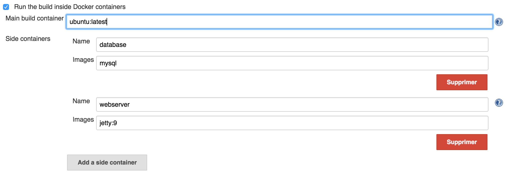
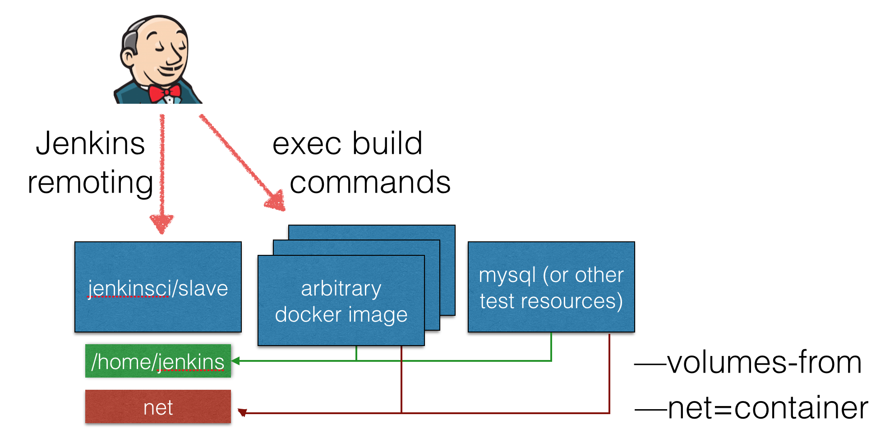

# Docker Slaves Plugin

This plugin allows to execute a jenkins job inside a (set of) container(s).
On Job configuration page, an option let you define a set of containers to host your build and provide test resources
(database, webserver, whatever). There's no constraint on the image to use, as all the jenkins related plumbing is
handled transparently by the plugin.

See [announcement](http://blog.loof.fr/2015/09/introducing-docker-slaves-jenkins-plugin.html) and [demo](https://www.youtube.com/watch?v=HbwgN0UTTxo)

## Status

Prototyping (Docker Global Hack Day). Don't run in production. Use at your own risk. etc.
Current implementation focus on Docker runtime, after cleanup the docker specific code will be isolated in a dedicated docker-slaves pluigin.

see https://issues.jenkins-ci.org/browse/JENKINS/component/20839 for issues/tasks/RFE

### What works?

The following things have been tested and works

* Freestyle job
* Maven job (as long as you configure a Maven installation with an automatic installer and you have a JDK in the build container)
* Timestamper plugin
* Git plugin

You can find sources of demos here: https://github.com/ydubreuil/docker-slaves-plugin-demos

## General Design

Global configuration let administrator setup the container infrastructure. Typically, a DockerHost URL, but could be extended by third party plugin to connect to another container hosting service, for sample to adapt to Kubernetes Pod API or Rkt container engine. Just need to be [opencontainer](https://www.opencontainers.org/) compliant.

To host a build, plugin will :
* create a data container to host the project workspace.
* run a predefined slave container which is designed to just establish jenkins remoting channel. 
* run a container for the scm to checkout project code
* (optionnaly) build a fresh new container image based on a Dockerfile stored in SCM
* run a (set of) containers configured by user as part of the job configuration. All them are linked together and share network

## Architecture

Plugin do rely on Jenkins Cloud API. Global configuration do only define a label, as slave template is actually declared in job configuration as a NodeProperty. 
This property allow user to define a container image to host the build, and an optional set of additional images to link to this one - those can be used to host a test database, or comparable resources. Need to consider if we could rely on docker-compose.yml syntax.
Internally, a unique slave image is defined and is responsible to establish jenkins remoting.

When a job is triggered, job configuration + remoting image do define a container group ("pod") the plugin has to run. ContainerProvisionner is responsible to run this pod. 

also see [Architecture.md](Architecture.md)

## [Docker](https://www.docker.com) implementation

Plugin includes a ContainerProvisionner implementation based on Docker CLI. This one will move to docker-slaves plugin when we get a reasonable design and can isolate general container
API.

This implementation do run the slave remoting container using a plain `docker run` command and rely on docker stdin/stdout as remoting transport (i.e. CommandLauncher or equivalent). 
The Launcher is decorated so command/process to be launched on the slave are directly executed with `docker exec`.

General idea is to avoid to use Jenkins remoting to launch processes but directly rely on Docker for this (what docker finally is is just an `execve` on steriods!). That magically brings long-running tasks for free.

Also Read [Docker implementation](Docker.md)

Note: this implementation relies on docker cli ran from jenkins master, and as such is using threads to manage the transient slave stdin/stdout steams. A NIO version would be lot's more efficient.

# Future

## Workflow support

see [this document](Workflow.md)

## Provisioning issue reporting

As the build container(s) are only used by a build, we'd like the container bootstrap log to be included in the job logs, or at least attached to the build action. This would help to diagnose provisioning issues.
For the same purpose, when the initial remoting container can't be provisionned, we'd like to mark the build as `NOT_BUILT` and attach docker logs

## Alternate implementations
Plugin is designed on top of Docker CLI features, but the general concept could apply to other container engines / docker cluster managers. We plan to extract a common skeleton into container-slaves-plugin, and experiment with alternate implementations.

### Kubernetes implementation

Kubernetes has native support for Pod concept, so would embrace this design with minimal effort.
Data container would rely on a [kubernetes volume](https://github.com/kubernetes/kubernetes/blob/master/docs/user-guide/volumes.md)

### Amazon ECS implementation

Comparable to Kubernetes.

### Mesos implementation

To be considered

### [Rkt](https://github.com/coreos/rkt) implementation

Supporting rkt runtime could be great from a security POV. rkt is able to launch containers isolated inside a small KVM process, greatly enhancing security (https://coreos.com/blog/rkt-0.8-with-new-vm-support/)

## Other ideas
 * Browse workspace after build completion by running a fresh new container with columes-from build's data-container
 * Slave view do offer a terminal access to the slave environment. Could rely on https://wiki.jenkins-ci.org/display/JENKINS/Remote+Terminal+Access+Plugin
 * Side containers or build container as a axis in multi-configuration job
 * Build throttling
 * Memory High Water Mark monitoring
 * support Docker Swarm / scheduling
 * integrate with ClearContainers for enhanced security

### Scalability
 * introduce and extension point to get Dockerhost based on job to run. Can rely on docker-swarm with container affinity, can also be a set of hosts managed by jenkins, running a dedicated monitoring container to check host load, optionnaly auto-scaling (using docker-machine ?).

### perf enhancements
 * put remoting JAR cache into docker slave image so launching slave will be much faster (add a second, read-only cache directory in `hudson.remoting.FileSystemJarCache`). On startup jenkins would then build the remoting image, then remoting channel can start without delay for future builds.
 
